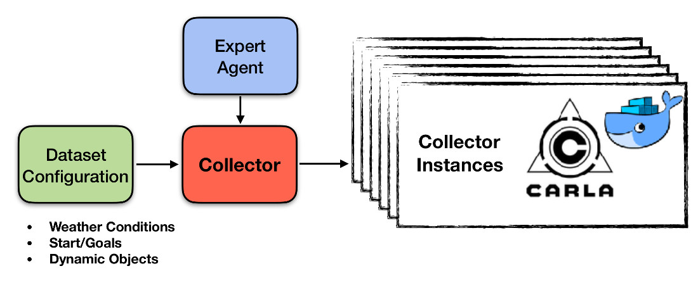

CARLA 0.8.4 Data Collector
==========================
Repository for data collection in CARLA version 0.8.4.
The data collected follows [this format](docs/dataset_format_description.md).

This repository contains the following features:

* An expert demonstrator for data collection, [documented here](docs/agent_module.md).
* The possibility to launch several CARLAs with docker for systems
with many GPUs to do scale up data collection.
* We also provide a version of CARLA's release 0.8.4 that does not switch gears. We call it CARLA Gear. This problem is discussed in [this issue](https://github.com/carla-simulator/carla/issues/269).

System Overview
---------------

The data collection is divided into a set of episodes performed
by an [expert hardcoded driver](docs/agent_module.md) to follow.

The user can configure a [dataset configuration file](dataset_configurations/coil_training_dataset_singlecamera.py).
This file contains a set of start/end positions, weathers and
 number of dynamic objects to appear on every data collection episode.
Further, the user also configure a [CARLA settings](https://carla.readthedocs.io/en/latest/cameras_and_sensors/) object containing
all the sensors that are going to be collected on this dataset.

This configuration file and the expert demonstrator
 are used inside a collector module that is replicated
 on several docker instances. This instances produce a dataset
 on some [specific format](docs/dataset_format_description.md).

Getting Started
---------------

#### Installation

To install the CoIL large scale training framework, we provide a conda environment requirements file. Basically, just do:

    conda env create -f requirements.yml

#### Downloading and starting the CARLA Gear server

To run this data collector you need a special version
of the CARLA server version 0.8.4. It is a version where
the ego-vehicle has a single gear.
This problem is discussed in [this issue](https://github.com/carla-simulator/carla/issues/269).

The server can be dowloaded with [this link](https://drive.google.com/open?id=1X52PXqT0phEi5WEWAISAQYZs-Ivx4VoE).

It is possible to collect data on a regular CARLA version,
however the controller will be less smooth.

#### Adding a single collection process

To run a single data collection process. First start a CARLA Gear Server. In a separate terminal, run:

    sh CarlaUE4.sh /Game/Maps/Town01 -windowed -world-port=2000  -benchmark -fps=10

In a second terminal, start the data collector:

    python3 collect.py

The collected dataset will be stored in the current folder.
More configuration and visualization details can be seen [here](docs/collect_options.md).

#### Massive data collection

To run a multi gpu data collection you need to have
a docker image of CARLA Gear server. For that you need
to [install docker](https://carla.readthedocs.io/en/latest/carla_docker/) and build an image of CARLA Gear:

    docker image build -f <carla_folder>/Util/Docker/Release.Dockerfile -t carlagear <path-to-carlagear/>CarlaGear

Where the CARLA folder is a checkout of the main CARLA repository.

The following command will open three CARLAs to collect 10 episodes
each and store them at `~/Datasets/AmazingData` path.

    python3 multi_gpu_collection.py -n 3 -e 10 --data-path ~/Datasets/AmazingData

By default it opens three CARLAs per GPU. Note you will see some connection closed errors
for a while until the CARLA dockers are ready to receive connections.
The collected data will have the following [data format](docs/dataset_format_description.md)
